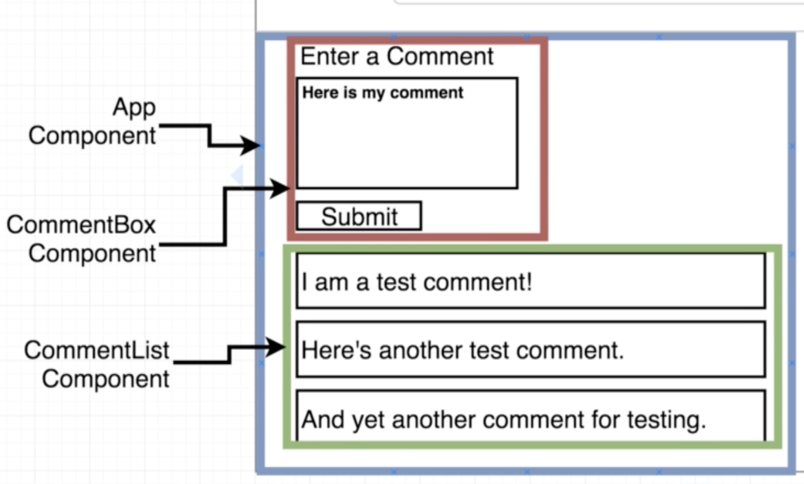
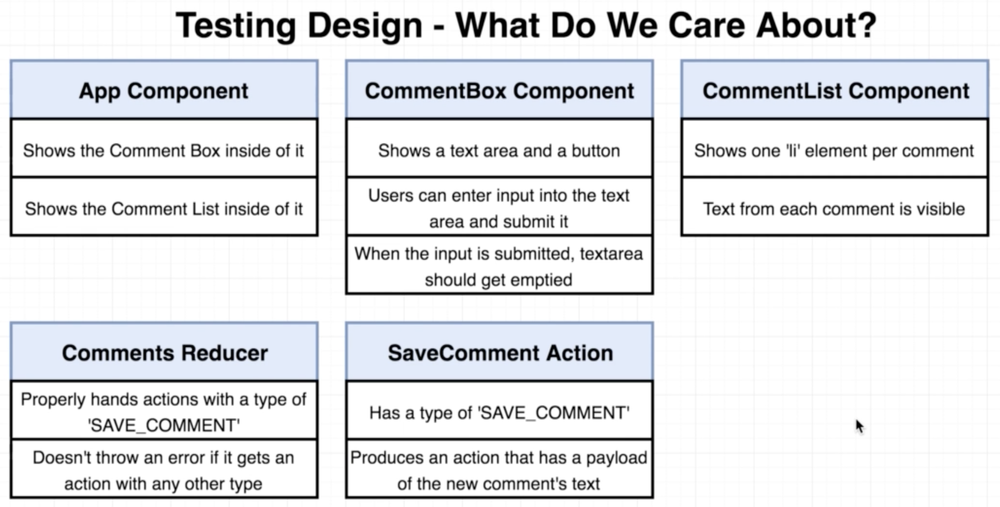
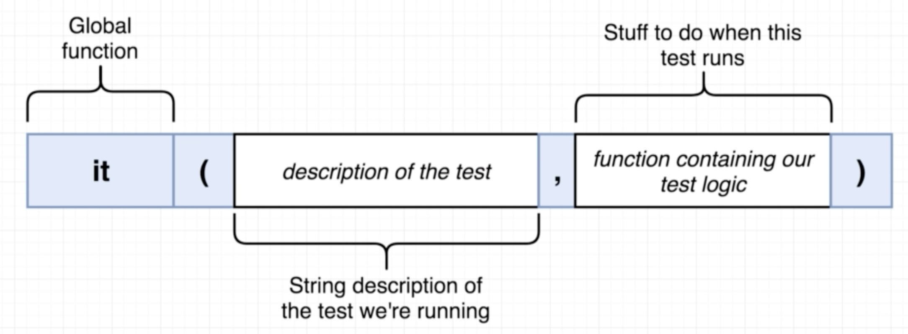
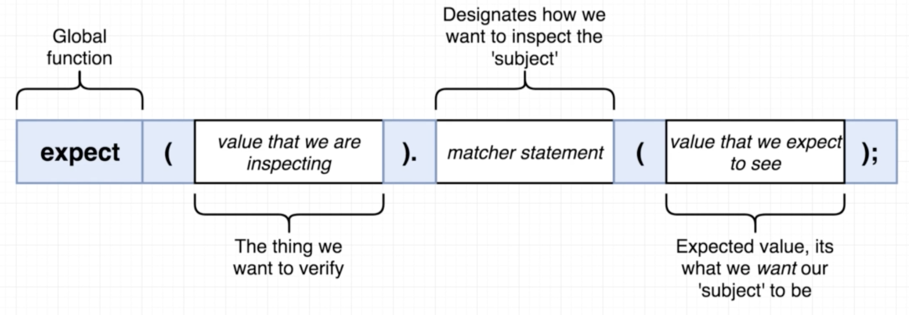
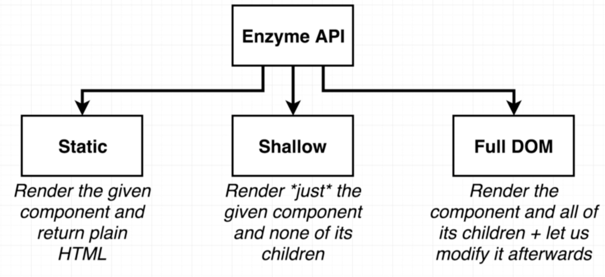
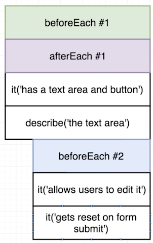
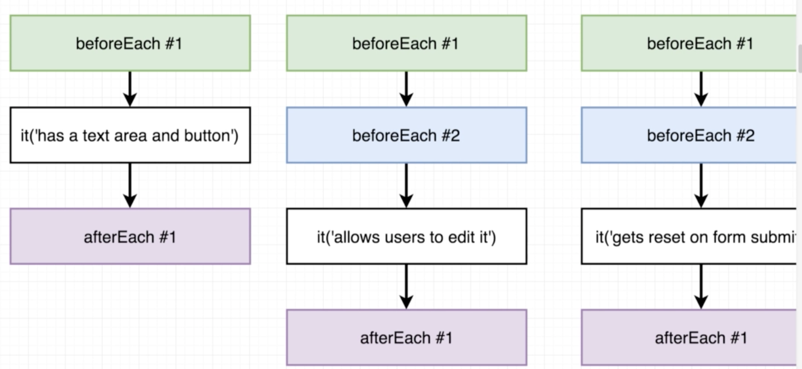
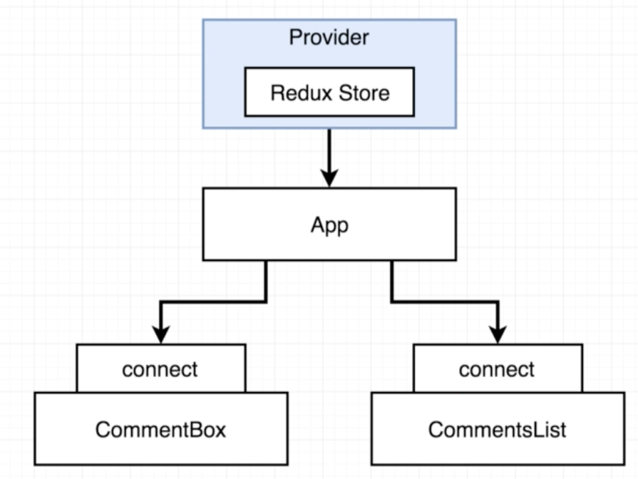

# Testing

## What to test?

Follow this flow:

As an example we can take following App:

In this react-redux app, if we would describe what to test, we would come up with following test cases:



## How to Test?

### It-Function
We test with the it() function:



When we work with React we make use of the JSDOM library to create face elements in JS, which are not in the DOM. JSDOM simulates how browsers behave and thus we can test our applicaiton in it.


```js
// App.test.js
import React from 'react';
import ReactDOM from 'react-dom';
import App from '../App';

it('shows a comment box', () => {
  const div = document.createElement('div');

  ReactDOM.render(<App />, div);

  // --- !!!! NOT A GOOD APPROACH !!!, 
  // --- because App.test needs to know how CommentBox works
  //  Looks inside the div
  //  and checks to see if the CommentBox is in there
  expect(div.innerHTML).toContain('Comment Box');

  // Clean Up after Testrun
  // Deletes our App out of the DOM
  ReactDOM.unmountComponentAtNode(div);
})

```
### Expect-Function
An expectation is the core of the test. Every "It-Statement" can contain expect functions. If one expect function returns 


## Enzyme
Is a library from Airbnb which allows a better Approach to testing React Components. Instead of checking for the inner workings of the component (see example above), it let's us check if a component exists.

[enzyme adapter](https://github.com/airbnb/enzyme/tree/master/packages/enzyme-adapter-react-16)

```json
// install enzyme and enyzme adapter
// the adapter depends on the version of react you are using
// see package.json your version of react

"dependencies": {
    "react": "^16.4.0",
    "react-dom": "^16.4.0",
    "react-redux": "^5.0.7",
    "react-scripts": "1.1.4",
    "redux": "^4.0.0"
  },
// Here you need to download enzyme-adapter-react-16
```
```bash
npm install --save enzyme enzyme-adapter-react-16
```

To use enzyme in our Projects we need to set it up by creating a ```setupTests.js``` in our ```src```. The name of the file is important, because anytime Jest starts up in the project, it looks for a ```setupTests.js``` file inside the ```src``` directory and executes it automatically before it executes any other code in the project. That's why it makes sense to set up any configuration for jest in that file. Otherwise we would need to configure the enzyme-adapter in every test.

```js
// src/setupTests.js
import Enzyme from 'enzyme';
import Adapter from 'enzyme-adapter-react-16';

Enzyme.configure({adapter: new Adapter});
```

Enzyme gives us three additional capabilities for writing tests. It allows us to render the component directly and we do not need to use the ReactDOM library, to render our component in a div (see example above). It has three render options:


* **static**
	* Renders the component and returns the plain HTML which the component returns. As it is pure HTML, it has no click event handlers etc. tied to it and we can't test any functionality.
* **shallow**
	* Renders no child components. Allows us to test just one component on itself in isolation, without taking any possible child components in consideration.
* **Full Dom**
	* Renders an instance of an component and all it's children components. You can render out a full copy of your application and make tests on it.

### shallow()
With a shallow render we can now do the same test as above but in a more generic way like this:

```js
import React from 'react';
import {shallow}from 'enzyme';
import App from '../App';
import CommentBox from '../CommentBox';
import CommentList from '../CommentList';


it('shows a comment box', () => {
  const wrapped = shallow(<App />);

  expect(wrapped.find(CommentBox).length).toEqual(1);
})

it('shows a comment list', () => {
  const wrapped = shallow(<App />);

  expect(wrapped.find(CommentList).length).toEqual(1);
});
```
### beforeEach()

To DRY up the above code we can use the ```beforeEach()``` function from jest. This function get's executed before Each test. 

```js
// we need to define wrapped outside the beforeEach because of
// the function scope, which would us not led access the variables in
// the it statements

// beforeEach runs before each it statement. Therefore wrapped get's 
// reassigned before each execution of an it statement.
let wrapped;
beforeEach(() => {
  wrapped = shallow(<App />);
})

it('shows a comment box', () => {
  expect(wrapped.find(CommentBox).length).toEqual(1);
});

it('shows a comment list', () => {
  expect(wrapped.find(CommentList).length).toEqual(1);
});
```

### mount() / Full DOM
The ```mount()``` function mounts the full DOM, meaning the normal HTML and the React Components. If you use ```mount``` you must always make sure to ```unmount()``` at the end of the use.

```js
import React from 'react';
import {mount} from 'enzyme';
import CommentBox from 'components/CommentBox';

it('has a text area and a button', () => {
  const wrapped = mount(<CommentBox />)
  expect(wrapped.find('button').length).toEqual(1);
  expect(wrapped.find('textarea').length).toEqual(1);

  wrapped.unmount();
});
```
The test above and following are based upon this component:

```js
import React, {Component} from 'react';
export default class CommentBox extends Component {
  state = {
    comment: '',
  };

  handleChange = (event) => {this.setState({comment: event.target.value})};

  handleSubmit = (event) => {
    event.preventDefault();
    this.setState({comment: ''});
  }

  render() {
    return (
      <form onSubmit={this.handleSubmit}>
        <h4>Add a Comment</h4>
        <textarea value={this.state.comment} onChange={this.handleChange} />
        <div>
          <button>Submit Comment</button>
        </div>
      </form>
    );
  }
}

```

### afterEach()
The test above can be made more DRY with using ```forEach()```. But that will cause problems, because we need to unmount after each test. To solve that problem we can use the ```afterEach()``` function, which get's executed after each it statement.

```js
import React from 'react';
import {mount} from 'enzyme';
import CommentBox from 'components/CommentBox';

let wrapped;

beforeEach(() => wrapped = mount(<CommentBox />))

afterEach(() => wrapped.unmount());

it('has a text area and a button', () => {
  expect(wrapped.find('button').length).toEqual(1);
  expect(wrapped.find('textarea').length).toEqual(1);
});
```

### simulate() & update() & prop()

To simulate an onChange event, we can use ```simulate('change', mockEvent)```. If we want to change the value of the ```event.target.value``` we can pass through a mock. The problem is that ```setState``` is asynchronous and therefore we can't do the assertion right after simulating the change event. To get ride of this problem we need to force React to update the state with the ```update()``` function.

To get the value of the ```textarea``` we can search again for it and call ```prop([key])``` on it. This returns the value of the prop which has been forwarded to that component (e.g. textarea is like any other component which takes props).

```js
it('has a text area that users can type in', () => {
  wrapped.find('textarea').simulate('change', {
    target: {
      value: 'FOO',
    },
  });
  wrapped.update();
  
  expect(wrapped.find('textarea').prop('value')).toEqual('FOO');
})
```

### describe('', () => {})

Describe are blocks to wrappe tests together. This can be useful do modify the scope of ```beforeEach``` or ```afterEach``` to only a certain amount of tests.

Below we use ```beforeEach``` twice, once for the whole test suite and once within the describe block.

```js
let wrapped;

beforeEach(() => wrapped = mount(<CommentBox />))

afterEach(() => wrapped.unmount());

it('has a text area and a button', () => {
  expect(wrapped.find('button').length).toEqual(1);
  expect(wrapped.find('textarea').length).toEqual(1);
});

describe('textarea', () => {
  beforeEach(() => {
    wrapped.find('textarea').simulate('change', {
      target: {
        value: 'new comment',
      },
    });
    wrapped.update();
  })

  it('has a text area that users can type in', () => {
    expect(wrapped.find('textarea').prop('value')).toEqual('new comment');
  })

  it('when form is submitted, textarea gets emptied', () => {
    wrapped.find('form').simulate('submit');
    wrapped.update();

    expect(wrapped.find('textarea').prop('value')).toEqual('');
  })
})
```
The above tests will get executed in following squence:





## Testing with Redux
When we wrap a component with a connect function, that connect function expects some parent component that has the ```<Provider>``` tag. 



Because we import components on itself without connection to the Provider when we test, the component throws a error and the test fails. Let's have a look at our current Setup:

```js
import React from 'react';
import ReactDOM from 'react-dom';

import {Provider} from 'react-redux';
import {createStore} from 'redux';
import reducers from 'reducers';

import App from 'components/App';

ReactDOM.render(
  <Provider store={createStore(reducers, {})}>
    <App />
  </Provider>,
  document.querySelector('#root')
);
```
### Bad Approach
One way to solve this is to just add a Provider to each test component.

```js
import React from 'react';
import {mount} from 'enzyme';
import {Provider} from 'react-redux';
import {createStore} from 'redux';
import reducers from 'reducers';

import CommentBox from 'components/CommentBox';

beforeEach(() =>{
  wrapped = mount(
    <Provider store={createStore(reducers, {})}>
      <CommentBox />
    </Provider>,
    );
});
```
### Good Approach
The Problem with the approach above is, that it does not scale very well. Because everytime we change the setup of the store (for e.g. adding a middleware), we would need to change all Providers in all the tests. The solve this problem in a more scalable way we create a ```Root.js``` file, which wraps the  provider around any child components.

```js
import React from 'react';
import {Provider} from 'react-redux';
import {createStore} from 'redux';
import reducers from 'reducers';

export default Root = () => {
  return (
    <Provider store={createStore(reducers, {})}>
      {props.children}
    </Provider>
  )
}
```
This Root just wraps the ```Provider``` around all the children with ```{props.children}```. Now we can apply any changes to the Provider just in the Root component and the App as well as the tests will continue working. 

```js
import React from 'react';
import ReactDOM from 'react-dom';

import Root from 'Root';
import App from 'components/App';

ReactDOM.render(
  <Root>
    <App />
  </Root>,
  document.querySelector('#root')
);
```
```js
import React from 'react';
import {mount} from 'enzyme';
import CommentBox from 'components/CommentBox';
import Root from 'Root';

let wrapped;

beforeEach(() =>{
  wrapped = mount(
    <Root>
      <CommentBox />
    </Root>
    );
});
```

#### Good Approach with Initial Redux State
The above example works fine as long as we don't want to set an inital state to redux when creating test cases. If we would for exmaple want to do sth like the code below, we don't get those inital comments we set. The reason is that when <CommentList> get's rendered, it runs the connect function and the intial state from redux get's set and thus our comments do get overwritten.

```js
// CommentList.test.js
let wrapped;
beforeEach(() => {
  wrapped = mount(
    <Root>
      <CommentList comments={['Comment 1', 'Comment 2']} />
    </Root>
  );
});
```
To make it possible to have an inital state we need to modify our Root component as follow:

```js
// Root.js
export default ({children, intialState = {}}) => {
  return (
    <Provider store={createStore(reducers, intialState)}>
      {children}
    </Provider>
  )
};
```
Here we set initialState as a possible prop of root. If we receive a initalState, we set that as the inital state. If we don't receive anything, we just set the intial state to be an empty object (same as before without this inititalState). We added argument deconstructering to set a default state for intialState. Now we can set an inital state in our tests as follow.

```js
let wrapped;

beforeEach(() => {
  const intialState  = {
    comments: ['Comment 1', 'Comment 2'],
  }
  wrapped = mount(
    <Root intialState = {intialState }>
      <CommentList/>
    </Root>
  );
});

```

## Testing Neworkrequests

To use network requests we need to install a couple of packages:

```npm install --save axios redux-promise moxios```

Then we need to add the ```redux-promise``` middlewear to the store as follow:

```js
import React from 'react';
import {Provider} from 'react-redux';
import {createStore, applyMiddleware} from 'redux';
import reduxPromise from 'redux-promise';
import reducers from 'reducers';

export default ({children, intialState = {}}) => {
  const store = createStore(reducers, intialState, applyMiddleware(reduxPromise));
  return (
    <Provider store={store}>
      {children}
    </Provider>
  )
};
```


